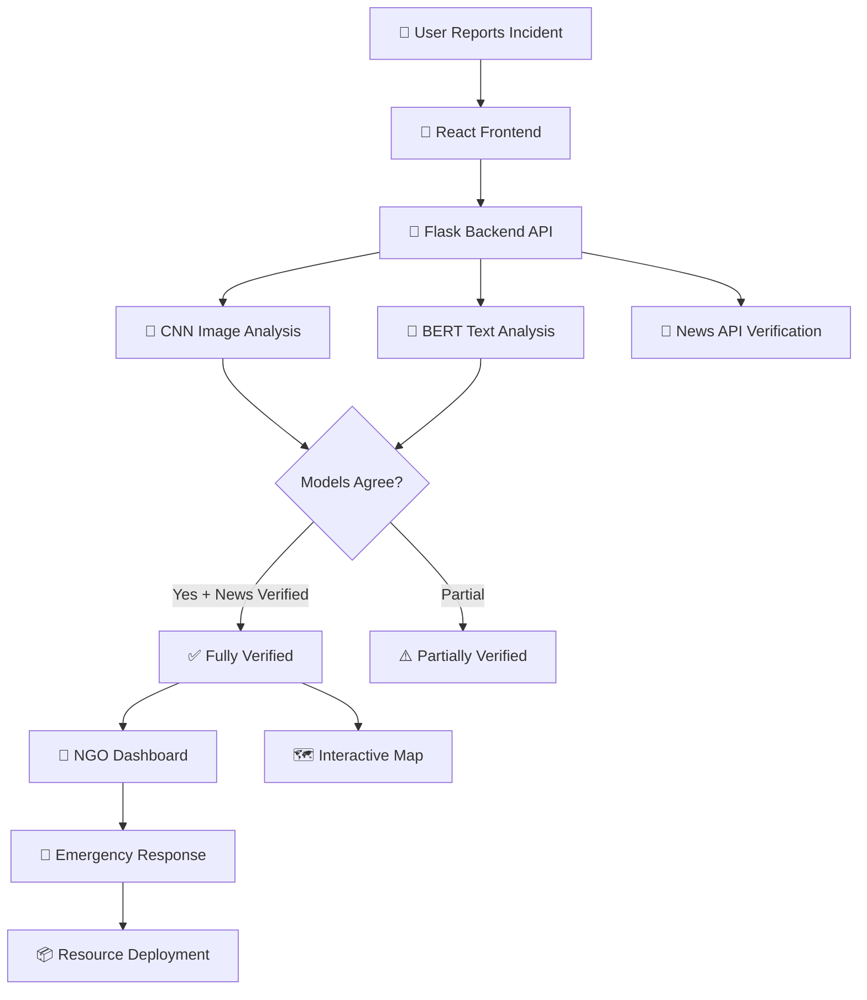
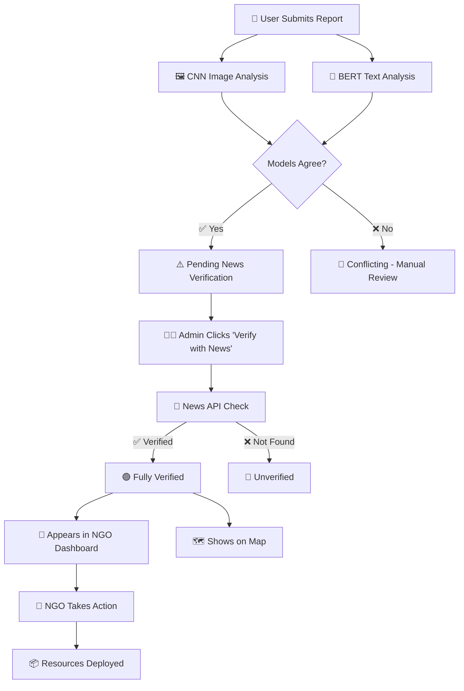

# 🚨 Disaster Relief Platform

<div align="center">


**A comprehensive full-stack web application for real-time disaster monitoring, reporting, and coordinated relief efforts with AI-powered image analysis, news verification, and NGO response coordination.**

[🌐 Live Demo](https://disaster-relief-platform-frontend.onrender.com/) • [📖 Documentation](#-api-documentation) • [🚀 Quick Start](#-quick-start) • [🤝 Contributing](#-contributing)

</div>

---

## 🌟 Key Features

<table>
<tr>
<td width="50%">

### 🤖 **AI-Powered Analysis**
- **CNN Image Classification** - Deep learning model for disaster image recognition
- **BERT Text Analysis** - Natural language processing for text classification
- **Multi-Model Consensus** - Triple verification system for accuracy
- **Real-time Processing** - Instant AI feedback on submissions

</td>
<td width="50%">

### 📊 **Real-time Dashboard**
- **Live Monitoring** - Updates every 5 seconds
- **Interactive Statistics** - Total reports, verified emergencies, active NGOs
- **Multi-level Verification** - Pending → Partially → Fully Verified
- **Admin Controls** - News verification and report management

</td>
</tr>
<tr>
<td width="50%">

### 🗺️ **Interactive Mapping**
- **Leaflet Integration** - Professional mapping with OpenStreetMap
- **Color-coded Markers** - Visual disaster type identification
- **Real-time Updates** - Automatic marker refresh
- **Detailed Popups** - Click markers for full disaster information

</td>
<td width="50%">

### 🏥 **NGO Coordination**
- **Response Portal** - Dedicated dashboard for relief organizations
- **Action Deployment** - Food, medical aid, shelter, rescue operations
- **Resource Tracking** - Monitor deployed resources and teams
- **Multi-NGO Support** - Coordinate multiple organizations

</td>
</tr>
</table>

---

## 🏗️ System Architecture



---

## 🔄 Multi-Model Verification System

<div align="center">

| Step | Process | Model/System | Output |
|------|---------|--------------|--------|
| 1️⃣ | **Image Analysis** | CNN (Convolutional Neural Network) | Disaster type from image |
| 2️⃣ | **Text Analysis** | BERT (Bidirectional Encoder Representations) | Disaster type from text |
| 3️⃣ | **Consensus Check** | Agreement Algorithm | Models must agree |
| 4️⃣ | **News Verification** | News API Integration | Cross-reference with news |
| 5️⃣ | **Final Status** | Multi-layer Validation | ✅ Fully Verified for NGOs |

</div>

### 🎯 Verification Levels

```
🔴 Pending Verification    → Initial submission, awaiting analysis
🟡 Partially Verified     → Some models agree, needs more validation  
🟢 Fully Verified         → CNN ✓ + BERT ✓ + News ✓ → NGO Dashboard
```

---

## 📁 Project Structure

```
Disaster-Relief-Platform/
├── 🎨 client/                     # React Frontend Application
│   ├── src/
│   │   ├── components/
│   │   │   ├── 📊 ClientDashboard.js      # Admin monitoring dashboard
│   │   │   ├── 📝 UserPortal.js           # Incident reporting form
│   │   │   ├── 🗺️ LeafletMap.js           # Interactive disaster map
│   │   │   └── 🏥 NGODashboard.js         # Relief coordination portal
│   │   ├── App.js                         # Main application component
│   │   └── index.js                       # Application entry point
│   ├── public/                            # Static assets
│   └── package.json                       # Frontend dependencies
├── 🐍 Flask/                      # Python Backend API
│   ├── app_working.py                     # Main Flask application
│   ├── disaster.h5                        # CNN model (not included)
│   └── requirements.txt                   # Backend dependencies
├── 🤖 final_model/                # BERT Model Files
│   ├── config.json                        # Model configuration
│   ├── model.safetensors                  # BERT model weights
│   ├── tokenizer.json                     # BERT tokenizer
│   └── vocab.txt                          # Vocabulary file
├── 📊 dataset/                    # Training Data (not included)
├── 📓 Model Building/             # Jupyter Notebooks
├── 🚀 start_system.bat            # Automated startup script
└── 📖 README.md                   # Project documentation
```

---

## 🚀 Quick Start

### Prerequisites
```bash
✅ Python 3.8+     ✅ Node.js 16+     ✅ Git
```

### 🎯 One-Click Setup
```bash
# Clone the repository
git clone https://github.com/premzade12/Disaster-Relief-Platform.git
cd Disaster-Relief-Platform

# Windows: Double-click start_system.bat
# This will automatically install all dependencies and start both servers
```

### 🛠️ Manual Setup

<details>
<summary>Click to expand manual setup instructions</summary>

#### Backend Setup
```bash
cd Flask
pip install -r requirements.txt
python app_working.py
```

#### Frontend Setup
```bash
cd client
npm install
npm start
```

</details>

---

## 🌐 Access Points

<div align="center">

| Portal | URL | Description |
|--------|-----|-------------|
| 🌐 **Live Demo** | https://disaster-relief-platform-frontend.onrender.com/ | **Hosted Application - Try it now!** |
| 📊 **Admin Dashboard** | http://localhost:3000/ | Monitor all reports, verify with news API |
| 🗺️ **Interactive Map** | http://localhost:3000/map | Visual disaster locations (fully verified only) |
| 🏥 **NGO Portal** | http://localhost:3000/ngo | Relief coordination (fully verified disasters) |
| 📝 **Report Incident** | http://localhost:3000/report | Public disaster reporting form |
| 🔧 **Backend API** | http://localhost:5000 | Flask REST API endpoints |

</div>

---

## 📱 User Journey & Features

### 1️⃣ **Incident Reporting** 
```
👤 User Experience:
├── 📝 Fill incident details (title, location, description)
├── 📷 Choose image source:
│   ├── 📸 Live camera capture (mobile-friendly)
│   └── 📁 File upload (drag & drop)
├── 🤖 Instant AI analysis (CNN + BERT)
└── ✅ Submission confirmation with AI results
```

### 2️⃣ **Admin Verification**
```
👨‍💼 Admin Dashboard:
├── 📊 Real-time statistics monitoring
├── 📋 Live incident feed with model predictions
├── 🔍 News API verification buttons
├── 📈 Multi-model agreement indicators
└── ✅ Final verification approval
```

### 3️⃣ **NGO Response**
```
🏥 NGO Coordination:
├── 📋 View only fully verified emergencies
├── 🎯 Select disaster for response
├── 🚀 Choose action type:
│   ├── 🚨 Emergency Relief
│   ├── 🍽️ Food Distribution  
│   ├── 🏥 Medical Aid
│   ├── 🏠 Shelter Setup
│   ├── 🚁 Rescue Operations
│   └── 💧 Water Supply
├── 📦 Deploy resources (food, medical, rescue teams)
└── 📊 Track active operations
```

---

## 🤖 AI Models & Technology Stack

### 🧠 **Artificial Intelligence**
<table>
<tr>
<td width="50%">

**🖼️ CNN (Image Classification)**
- **Architecture**: Convolutional Neural Network
- **Input**: Disaster images (64x64 RGB)
- **Output**: 4 disaster types with confidence
- **Classes**: Cyclone, Earthquake, Flood, Wildfire
- **Framework**: TensorFlow/Keras

</td>
<td width="50%">

**📝 BERT (Text Classification)**
- **Architecture**: DistilBERT for Sequence Classification
- **Input**: Title + Description text
- **Output**: Disaster type classification
- **Max Length**: 512 tokens
- **Framework**: Transformers/PyTorch

</td>
</tr>
</table>

### 💻 **Technology Stack**

<div align="center">

| Layer | Technology | Purpose |
|-------|------------|---------|
| **Frontend** |   | User interface, responsive design |
| **Backend** |   | REST API, business logic |
| **AI/ML** |   | CNN + BERT models |
| **Mapping** |   | Interactive maps |
| **Database** |  | In-memory storage (demo) |

</div>

---

## 🔧 API Documentation

### 📡 **Core Endpoints**

<details>
<summary><strong>📊 GET /api/stats</strong> - Dashboard Statistics</summary>

```json
{
  "total_reports": 15,
  "verified_emergencies": 8,
  "active_ngos": 3,
  "pending_verification": 4,
  "news_verified": 6
}
```
</details>

<details>
<summary><strong>📋 GET /api/reports</strong> - All Disaster Reports</summary>

```json
[
  {
    "_id": 1,
    "title": "Heavy Flooding in Downtown",
    "location": "Mumbai, Maharashtra",
    "description": "Severe flooding in commercial area",
    "cnn_prediction": "Flood",
    "cnn_confidence": 0.89,
    "bert_prediction": "Flood", 
    "bert_confidence": 0.92,
    "models_agree": true,
    "disaster_type": "Flood",
    "news_verified": true,
    "final_verified": true,
    "status": "Fully Verified",
    "timestamp": "2024-01-01T12:00:00Z"
  }
]
```
</details>

<details>
<summary><strong>📝 POST /api/report</strong> - Submit New Report</summary>

**Request**: Multipart form data
- `title`: Incident title
- `location`: Geographic location  
- `description`: Detailed description
- `image`: Photo file (JPG/PNG)

**Response**:
```json
{
  "success": true,
  "ai_result": "CNN Analysis: Flood (89%)\nBERT Analysis: Flood (92%)\nModels Agree: Yes\nFinal Classification: Flood",
  "report_id": 4
}
```
</details>

### 🔍 **Verification Endpoints**

<details>
<summary><strong>🔍 POST /api/verify-report/{id}</strong> - News Verification</summary>

```json
{
  "success": true,
  "verification_result": {
    "verified": true,
    "confidence": 0.85,
    "source": "News API",
    "articles_found": 3
  },
  "models_agree": true,
  "final_verified": true,
  "updated_status": "Fully Verified"
}
```
</details>

### 🏥 **NGO Endpoints**

<details>
<summary><strong>🏥 GET /api/ngo/verified-reports</strong> - Fully Verified Disasters</summary>

Returns only disasters that passed all three verification stages (CNN + BERT + News)
</details>

<details>
<summary><strong>🚀 POST /api/ngo/take-action</strong> - Deploy Emergency Response</summary>

```json
{
  "report_id": 1,
  "action_type": "Emergency Relief",
  "resources": ["Food Packets", "Medical Supplies", "Rescue Team"],
  "ngo_name": "Red Cross India"
}
```
</details>

---

## 🎯 Disaster Classification

<div align="center">

| Disaster Type | 🖼️ CNN Recognition | 📝 BERT Keywords | 🎨 UI Color | 📍 Map Marker |
|---------------|-------------------|------------------|-------------|---------------|
| **🌊 Flood** | Water, flooding patterns | "flood", "water", "submerged" | Blue `#3B82F6` | 🔵 |
| **🏚️ Earthquake** | Structural damage, cracks | "earthquake", "tremors", "shaking" | Red `#EF4444` | 🔴 |
| **🌪️ Cyclone** | Spiral patterns, wind damage | "cyclone", "hurricane", "storm" | Purple `#8B5CF6` | 🟣 |
| **🔥 Wildfire** | Fire, smoke, burnt areas | "fire", "wildfire", "burning" | Orange `#F59E0B` | 🟠 |

</div>

---

## 📊 Verification Workflow



---

## 💻 Installation & Setup

### 🔧 **System Requirements**

<table>
<tr>
<td width="50%">

**Backend Requirements**
```bash
Python 3.8+
Flask 2.3.3
TensorFlow 2.13.0
PyTorch 2.0.1
Transformers 4.57.3
OpenCV 4.8.1
NumPy 1.24.3
```

</td>
<td width="50%">

**Frontend Requirements**
```bash
Node.js 16+
React 18.2.0
Axios 1.6.0
React Router DOM 6.8.0
Tailwind CSS (CDN)
```

</td>
</tr>
</table>

### 📦 **Model Files Required**

| Model | Location | Size | Purpose |
|-------|----------|------|---------|
| **CNN Model** | `Flask/disaster.h5` | ~50MB | Image classification |
| **BERT Model** | `final_model/` | ~250MB | Text classification |
| **Training Data** | `dataset/` | ~2GB | Model training (optional) |

---

## 🎮 Usage Guide

### 👨‍💼 **For Administrators**

1. **Monitor Dashboard** - View real-time statistics and incident feed
2. **Review Predictions** - Check CNN and BERT model agreement
3. **Verify with News** - Cross-reference incidents with news sources
4. **Approve Reports** - Mark as fully verified for NGO response

### 👤 **For Citizens**

1. **Report Incident** - Navigate to `/report`
2. **Provide Details** - Title, location, description
3. **Add Evidence** - Camera capture or file upload
4. **Get AI Feedback** - Instant classification results

### 🏥 **For NGOs**

1. **Access Portal** - Navigate to `/ngo`
2. **View Emergencies** - Only fully verified disasters
3. **Select Response** - Choose appropriate action type
4. **Deploy Resources** - Coordinate relief efforts
5. **Track Operations** - Monitor active responses

---

## 🔒 Security & Reliability

### 🛡️ **Data Validation**
- **Multi-model Consensus** - Reduces false positives
- **News Cross-verification** - Prevents misinformation
- **Image Format Validation** - Secure file handling
- **Input Sanitization** - XSS protection

### 📈 **Performance Features**
- **Real-time Updates** - WebSocket-like polling
- **Efficient Caching** - Optimized API responses
- **Responsive Design** - Mobile-first approach
- **Error Handling** - Graceful failure recovery

---

## 🚨 Troubleshooting

<details>
<summary><strong>🔧 Common Issues & Solutions</strong></summary>

| Issue | Cause | Solution |
|-------|-------|----------|
| **"BERT model not loaded"** | Missing model files | Ensure `final_model/` folder exists |
| **"CNN model not found"** | Missing disaster.h5 | Train model or get from repository owner |
| **"Camera access denied"** | Browser permissions | Allow camera in browser settings |
| **"Backend not running"** | Flask server down | Run `python app_working.py` |
| **"CORS errors"** | Cross-origin issues | Check flask-cors installation |
| **"PyTorch >= 2.1 required"** | Version compatibility | Update PyTorch: `pip install torch>=2.1.0` |
| **"TensorFlow GPU warnings"** | CUDA not found | Normal on CPU-only servers (Render) |

</details>

### 🌐 **Deployment Notes**
- **Live Demo**: Frontend deployed successfully on Render
- **Backend Status**: CNN model ✅ loaded, BERT model ⚠️ (fallback to keyword matching)
- **Current Functionality**: Image classification working, text analysis using keyword fallback
- **Production Fix**: Updated PyTorch to >= 2.1.0 in requirements.txt

---

## 🌟 Advanced Features

### 🔄 **Real-time Capabilities**
- **Live Dashboard Updates** - 5-second refresh intervals
- **Instant AI Processing** - Sub-second model inference
- **Dynamic Map Updates** - Real-time marker placement
- **Push Notifications** - Alert system for critical incidents

### 📊 **Analytics & Insights**
- **Disaster Pattern Analysis** - Historical data trends
- **Response Time Metrics** - NGO performance tracking
- **Geographic Hotspots** - High-risk area identification
- **Model Accuracy Monitoring** - AI performance metrics

---

## 🤝 Contributing

We welcome contributions! Here's how you can help:

### 🎯 **Areas for Contribution**
- **🤖 AI Models** - Improve CNN/BERT accuracy
- **🗺️ Mapping** - Enhanced geographic features
- **📱 Mobile App** - Native mobile application
- **🔗 API Integration** - Real news API connections
- **🎨 UI/UX** - Design improvements
- **🧪 Testing** - Unit and integration tests

### 📋 **Development Process**
```bash
1. Fork the repository
2. Create feature branch: git checkout -b feature/amazing-feature
3. Make your changes
4. Test thoroughly
5. Commit: git commit -m 'Add amazing feature'
6. Push: git push origin feature/amazing-feature
7. Open Pull Request
```

---

## 📄 License & Acknowledgments

### 📜 **License**
This project is licensed under the MIT License - see the [LICENSE](LICENSE) file for details.

### 🙏 **Acknowledgments**
- **OpenStreetMap** - Free geographic data
- **Leaflet.js** - Interactive mapping library
- **Hugging Face** - BERT model and transformers
- **TensorFlow Team** - CNN framework
- **React Team** - Frontend framework
- **Flask Team** - Backend framework

---

<div align="center">

### 🌟 **Star this repository if it helped you!**

[](https://github.com/premzade12/Disaster-Relief-Platform/stargazers)
[](https://github.com/premzade12/Disaster-Relief-Platform/network)

**Built with ❤️ for disaster relief and emergency response**

[🔝 Back to Top](#-disaster-relief-platform)

</div>

---

**⚠️ Important Notes:**
- AI model files not included due to size constraints
- Dataset not included due to size constraints  
- News API integration is mocked for demonstration
- This is a demonstration system - adapt for production use
- Ensure proper security measures for production deployment